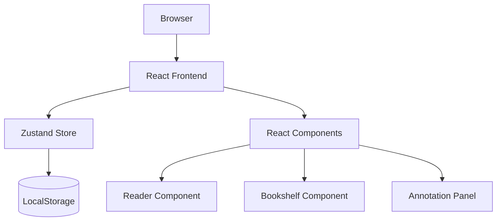
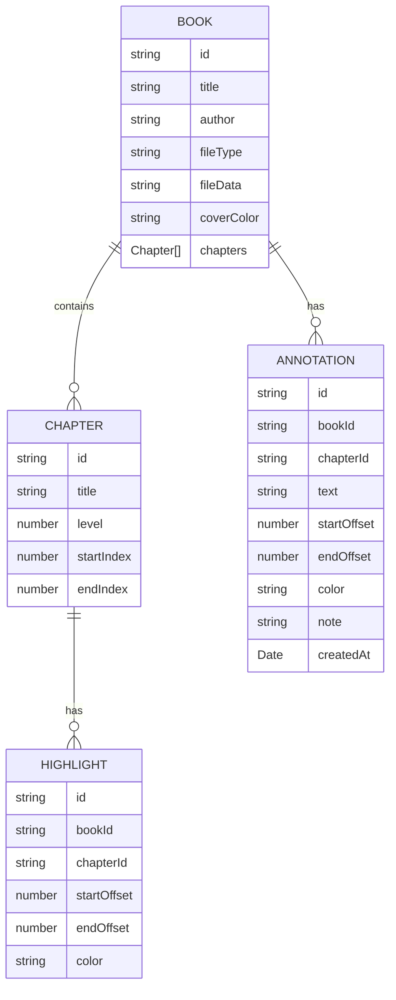

## 1. Architecture Design


## 2. Technology Description
- Frontend: React@18 + TypeScript + tailwindcss@3 + vite
- State Management: zustand
- UI Components: lucide-react for icons
- Storage: Browser LocalStorage for books and annotations
- No backend needed, pure frontend application

## 3. Route Definitions
| Route | Purpose |
|-------|---------|
| / | Main reading page with 3-column layout |
| /bookshelf | Bookshelf and book management page |
| /concepts | Concepts library page |

## 4. Data Model

### 4.1 Data Model Definition


### 4.2 TypeScript Interfaces
```typescript
// File: src/types/index.ts

export interface Chapter {
  id: string;
  title: string;
  level: number;
  startIndex: number;
  endIndex: number;
}

export interface Annotation {
  id: string;
  bookId: string;
  chapterId: string;
  text: string;
  startOffset: number;
  endOffset: number;
  color: string;
  note: string;
  createdAt: Date;
}

export interface Highlight {
  id: string;
  bookId: string;
  chapterId: string;
  startOffset: number;
  endOffset: number;
  color: string;
}

// Extend existing Book interface
export interface Book {
  // ... existing properties
  chapters: Chapter[];
  annotations: Annotation[];
  highlights: Highlight[];
}
```

## 5. Core Implementation Plan

### 5.1 Chapter Recognition Logic
```typescript
// File: src/utils/chapterParser.ts

export function parseChapters(text: string): Chapter[] {
  const chapters: Chapter[] = [];
  const patterns = [
    // 中文章节：第X章/节/篇
    /^第[一二三四五六七八九十百千万\d]+[章节篇卷].*$/gm,
    // Chapter X
    /^Chapter\s+\d+.*$/gim,
    // §符号
    /^§\s*\d+.*$/gm,
  ];

  // Parse and extract chapters
  // ... implementation
  
  return chapters;
}
```

### 5.2 Text Selection & Highlight
- Use `window.getSelection()` API
- Create range and apply highlight
- Store ranges with offsets for persistence

### 5.3 Zustand Store
- Manage current book, chapter, annotations
- Sync with LocalStorage
- Handle file upload and chapter parsing
