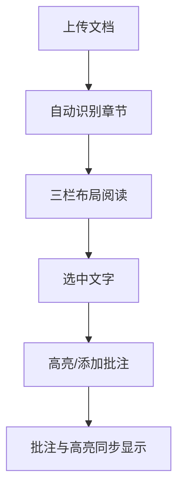

## 1. Product Overview
哲学阅读陪读分析应用，帮助用户高效阅读哲学书籍，提供多格式文档导入、智能章节识别、文本批注和高亮功能。
- 解决哲学书籍阅读难点：概念复杂、翻译差异大、逻辑难懂
- 为哲学爱好者和学习者提供辅助阅读工具

## 2. Core Features

### 2.1 Feature Module
1. **Reader**: 三栏布局阅读页面，包含左侧书架、中间正文、右侧批注面板
2. **Bookshelf**: 书籍管理，支持多格式上传
3. **Highlight & Annotation**: 文本高亮（4种颜色）和批注功能

### 2.3 Page Details
| Page Name | Module Name | Feature description |
|-----------|-------------|---------------------|
| Reader | 左侧书架 | 显示最近阅读书籍，可快速切换 |
| Reader | 中间正文 | 显示阅读内容，支持章节导航 |
| Reader | 右侧批注 | 显示批注列表，与正文联动 |
| Bookshelf | 上传功能 | 支持PDF、TXT、Markdown等格式上传 |
| Bookshelf | 章节识别 | 自动识别多种章节格式并生成目录 |

## 3. Core Process
用户上传文档 → 系统自动识别章节 → 在阅读页面三栏布局中阅读 → 选中文字进行高亮或添加批注 → 批注与高亮同步显示

## 4. User Interface Design
### 4.1 Design Style
- 配色：主色调棕褐色（#8B7355），暖色调营造阅读氛围
- 按钮：圆角矩形，简洁实用
- 字体：标题使用Noto Serif SC，正文使用Noto Sans SC
- 布局：三栏式固定布局，左侧20%，中间55%，右侧25%
- 风格：简洁优雅，符合阅读应用调性

### 4.2 Page Design Overview
| Page Name | Module Name | UI Elements |
|-----------|-------------|-------------|
| Reader | 三栏布局 | 左侧可折叠书架，中间正文区域，右侧批注面板 |
| Reader | 正文高亮 | 4种高亮颜色（黄色、绿色、蓝色、紫色） |
| Reader | 批注面板 | 显示当前页面所有批注，点击跳转到对应位置 |
| Bookshelf | 上传区域 | 拖拽上传区域，支持多种格式 |
| Bookshelf | 书籍列表 | 卡片式布局，显示封面和基本信息 |

### 4.3 Responsiveness
- Desktop-first，支持平板和移动端自适应
- 移动端堆叠布局，侧边栏改为抽屉式
- 触摸优化，支持滑动翻页和双击放大
