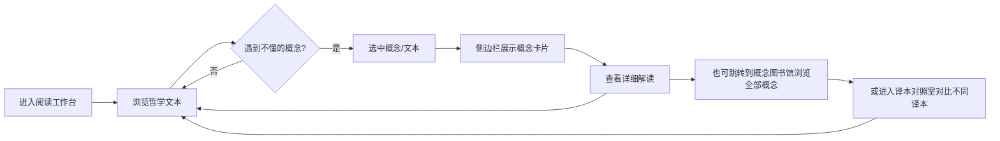

## 1. 产品概述

哲学阅读陪读分析工具，帮助哲学读者更高效地阅读和理解哲学著作。
- 解决阅读哲学书籍时概念难懂、需要反复查阅以及不同译本对照困难的问题
- 面向哲学爱好者、学术研究者、哲学专业学生等需要深度阅读哲学文本的用户

## 2. 核心功能

### 2.1 用户角色

| 角色 | 方式 | 核心权限 |
|------|------|----------|
| 读者 | 直接访问 | 浏览所有功能，无需注册 |

### 2.2 功能模块

1. **阅读工作台**: 核心阅读区域，展示原文文本，支持段落级交互和概念即时查询
2. **概念图书馆**: 集中展示哲学概念的卡片库，支持搜索和分类筛选
3. **译本对照室**: 同一段落不同译本的并排对照阅读

### 2.3 页面详情

| 页面名称 | 模块名称 | 功能描述 |
|----------|----------|----------|
| 阅读工作台 | 文本展示区 | 展示哲学原文段落，支持选中查询概念 |
| 阅读工作台 | 概念侧边栏 | 选中概念后弹出详细解释卡片 |
| 阅读工作台 | 段落解读 | 对当前段落展示解读分析内容 |
| 概念图书馆 | 概念卡片网格 | 以卡片形式展示所有哲学概念及其简要释义 |
| 概念图书馆 | 搜索筛选栏 | 支持按关键词搜索和按类别筛选概念 |
| 概念图书馆 | 概念详情弹窗 | 点击卡片后弹出完整的概念解读 |
| 译本对照室 | 并排对比视图 | 同一段落2-3个译本的并排对照阅读 |
| 译本对照室 | 段落同步滚动 | 多栏文本同步滚动，逐段对照 |

## 3. 核心流程

用户进入阅读工作台 → 阅读哲学文本段落 → 遇到不熟悉的概念 → 选中文本 → 侧边栏自动显示概念卡片

## 4. 用户界面设计

### 4.1 设计风格

- **整体基调**: 学术藏书风格 —— 温暖、沉静、富有书卷气，营造"私人书房"的沉浸阅读感
- **主色调**: 暖棕色系 (#4A3728, #8B7355) + 米白底色 (#F5F0E8)
- **强调色**: 深红色 (#8B2500) 用于标注重点和交互元素
- **字体**: 标题使用「思源宋体」(Noto Serif SC)，正文使用「宋体」或衬线风格，体现学术感
- **按钮风格**: 简洁文字按钮，hover 时有下划线或柔和背景变化
- **布局风格**: 左右分栏布局（左侧文本区占2/3，右侧侧边栏占1/3），卡片式概念展示
- **图标风格**: 极简线条风格图标
- **背景细节**: 微妙的纸张纹理和书页阴影效果

### 4.2 页面设计概览

| 页面名称 | 模块名称 | UI 元素 |
|----------|----------|---------|
| 阅读工作台 | 导航栏 | 顶部导航，包含页面切换链接，暖棕色背景，白色文字 |
| 阅读工作台 | 文本展示区 | 左侧大面积文本展示，段落间距舒适，选中文本可高亮 |
| 阅读工作台 | 概念侧边栏 | 右侧窄栏，选中概念后滑入展示，包含概念名、释义、相关概念链接 |
| 阅读工作台 | 段落解读区 | 文本下方或侧边栏内展示，对当前段落提供解读分析 |
| 概念图书馆 | 概念卡片网格 | 自适应网格布局，每张卡片包含概念名、简短定义、所属领域标签 |
| 概念图书馆 | 搜索栏 | 顶部搜索框，带搜索图标，支持实时过滤 |
| 概念图书馆 | 详情弹窗 | 点击卡片后弹出模态窗口，展示完整解读、关联概念、引用出处 |
| 译本对照室 | 并排视图 | 两栏或三栏对照布局，每栏顶部显示译本名称和译者信息 |
| 译本对照室 | 同步滚动控制 | 拖动任一栏滚动条时其他栏同步移动 |

### 4.3 响应式设计

- 桌面优先设计，针对 1440px+ 屏幕优化
- 平板端：侧边栏可折叠为底部抽屉，保留阅读区宽度
- 移动端：单栏布局，概念查询改为底部弹出面板

## 5. 数据模型

### 核心数据结构

- **概念(Concept)**: 概念名称、拼音索引、简短释义、详细解读、所属领域、关联概念列表、引用出处
- **文本段落(Paragraph)**: 原文内容、章节信息、关联概念列表、解读分析
- **译本(Translation)**: 译本名称、译者、出版社、段落内容列表