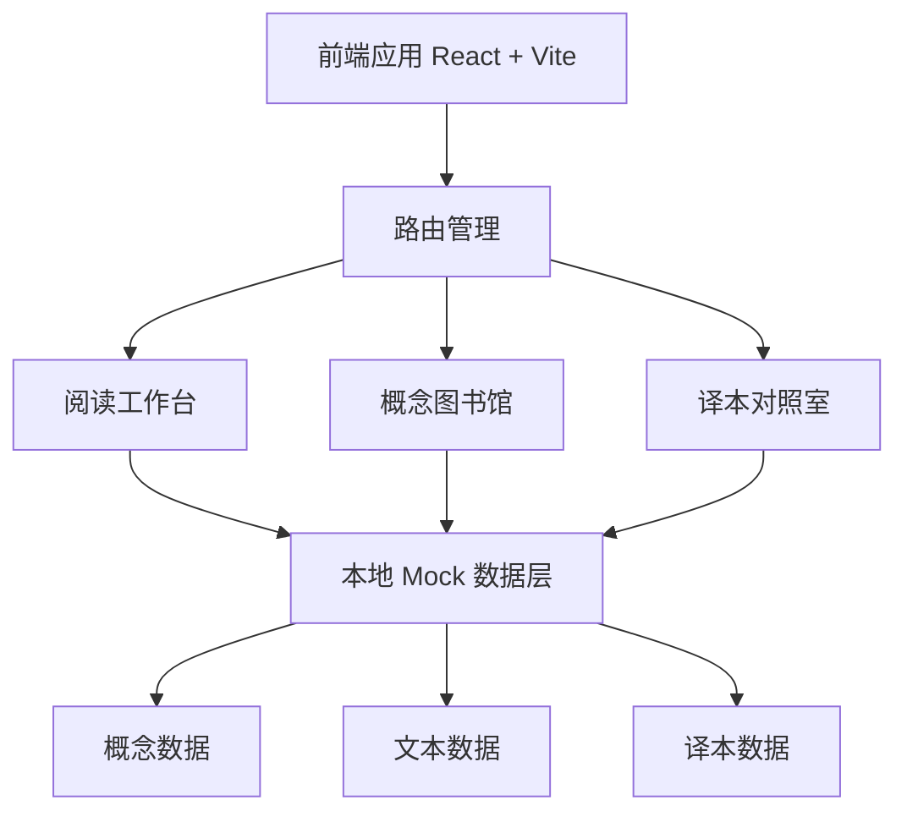

## 1. 架构设计



## 2. 技术选型

- **前端框架**: React@18 + TypeScript
- **样式方案**: Tailwind CSS@3
- **构建工具**: Vite
- **路由管理**: React Router@6
- **初始化工具**: Vite 脚手架 (create vite)
- **后端**: 无，纯前端应用，使用本地 Mock 数据
- **数据管理**: React Context + 本地 JSON 数据文件

## 3. 路由定义

| 路由路径 | 页面名称 | 说明 |
|----------|----------|------|
| / | 阅读工作台 | 默认首页，核心阅读和分析功能 |
| /concepts | 概念图书馆 | 所有哲学概念的卡片浏览 |
| /compare | 译本对照室 | 不同译本的并排对比 |

## 4. 组件设计

| 组件名称 | 所属页面 | 功能描述 |
|----------|----------|----------|
| Navigation | 全局 | 顶部导航栏，页面切换 |
| ReaderView | 阅读工作台 | 文本展示和交互区域 |
| ConceptPanel | 阅读工作台 | 概念查询侧边栏 |
| AnalysisSection | 阅读工作台 | 段落解读分析区域 |
| ConceptCard | 概念图书馆 | 概念卡片组件 |
| ConceptGrid | 概念图书馆 | 卡片网格布局组件 |
| ConceptDetail | 概念图书馆 | 概念详情弹窗 |
| CompareView | 译本对照室 | 多栏对照阅读组件 |
| CompareColumn | 译本对照室 | 单栏译本展示组件 |

## 5. 数据模型

### 5.1 概念数据模型

```typescript
interface Concept {
  id: string;
  name: string;
  pinyin: string;
  shortDefinition: string;
  detailedExplanation: string;
  field: string; // 所属领域: 存在论/认识论/伦理学等
  relatedConcepts: string[]; // 关联概念ID列表
  source: string; // 引用出处
}

interface TextParagraph {
  id: string;
  chapter: string;
  section: string;
  content: string;
  relatedConcepts: string[];
  analysis: string;
}

interface Translation {
  id: string;
  name: string;
  translator: string;
  publisher: string;
  year: number;
  paragraphs: {
    id: string;
    content: string;
    paragraphIndex: number;
  }[];
}
```

## 6. Mock 数据内容

- **哲学概念**: 涵盖存在主义、现象学、认识论等领域的 20+ 核心概念
- **原文段落**: 选取 1-2 部哲学经典（如《存在与时间》《纯粹理性批判》）的精彩段落
- **译本数据**: 选取 2-3 个经典译本的对应段落

初始数据内容:
- 概念示例: 此在(Dasein)、存在(Sein)、现象学(Phenomenology)、本质(Wesen)、超越(Transzendenz)等
- 文本选段: 海德格尔《存在与时间》导论部分
- 译本对照: 陈嘉映译本、孙周兴译本等